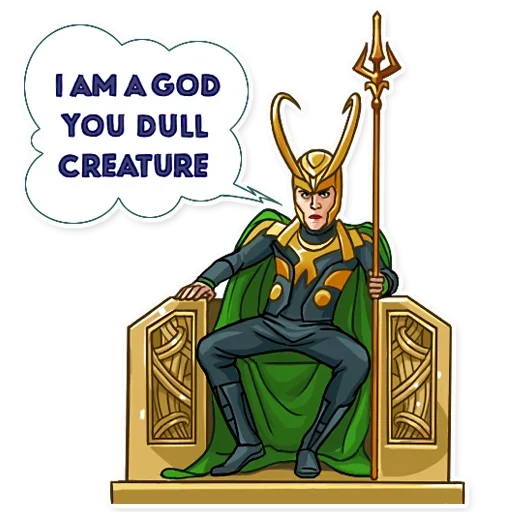

#### <b>welcome!!!</b>
  
  

# Stylish Text Font Bot ✒️✨
this is my personal project

## Deploy the bot on heroku

## Variables🔥🔥

### Required Variables

- `API_HASH:` Get this value from [my.telegram.org](https://my.telegram.org) or [@UseTGzKBot ](https://telegram.dog/UseTGzKbot).

- `API_KEY:` Get this value from [my.telegram.org](https://my.telegram.org) or [@UseTGzKBot ](https://telegram.dog/UseTGzKbot).

- `BOT_TOKEN:` Get the bot token from [Bot Father ](https://telegram.dog/BotFather)

- `OWNER_ID:` Get your user id from [@DingdiBot ](https://telegram.dog/DingdiBot) or [@UseTGidBot ](https://telegram.dog/UseTGidBot)les

## Features🔥 

* Stylish your Text

## Notes🔥

* දැනට මාස් සතුව වචන තේමා[word fronts] 40  ක් පවතිනවා
  
## Commands🔥

* /start-start my bot.

## To-Do :

- [x] Stylish your Text

### Trademark ™

  

  * you can copy this repo but you can't be dev.
  * 💔 please add star ⭐⭐ and follow me 💔 
  * 💯 add your comment here :[comment form](https://docs.google.com/forms/d/e/1FAIpQLSdzPp95JdFH-8XAaE5is_7Qq5jAFMLRi17ZIL_w5miP_Unnrw) 💯
  * 💬 contact me in whatsapp : [whatsapp](https://wa.me/message/U7BRUKT3H6B5E1)
  * 💬 contact me in telegram :[telegram](https://t.me/senith_0831)

# Bye 🔥🖐🖐🖐🖐🔥

# please add star ⭐⭐⭐⭐⭐⭐⭐⭐⭐⭐⭐⭐⭐⭐

